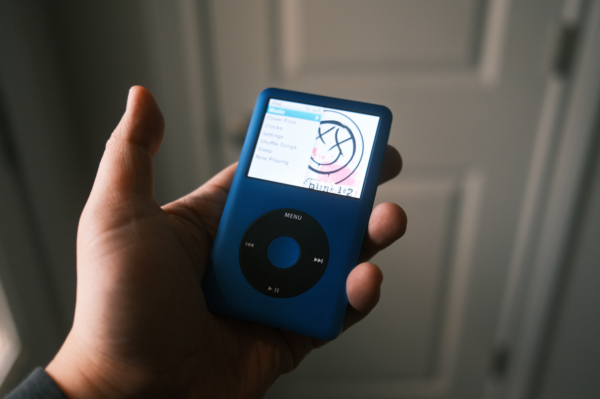
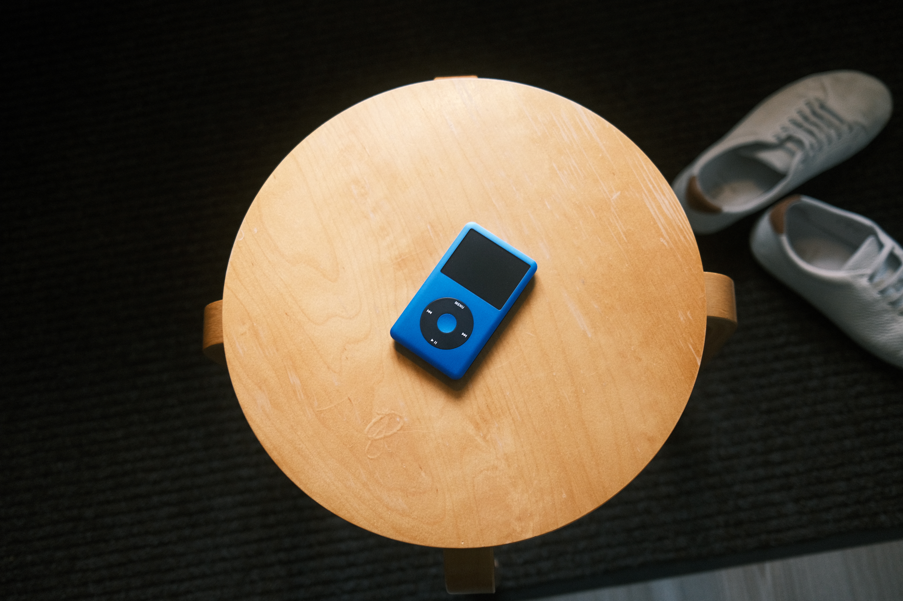

I started using iPods again. Here's what makes them work for me in 2024:

- **Sync music with Finder:** all of that syncing stuff got moved from iTunes into Finder. As long as you have local music in your Apple Music library, Finder will sync over to your iPod just like iTunes back in the day. This works for me because I don't rely on music streaming anymore.

- **Modern upgrades**: I opted to buy a few iPods with some modern upgrades: flash storage, bigger batteries and usb-c. I also have one with bluetooth but I prefer to use wired headphones with all these lil guys.

- **Small and lightweight**: iPods are noticeably smaller and lighter than my iPhone 15 Pro. They almost feel as light as my Airpods Pro 2. It's surprising how easy it is to carry this around in my pocket and forget it's there.

- **Headphone jack**: Wired headphones! means less dependencies on things failing like bluetooth, battery, or losing your left airpod.

## My Collection

TBD
