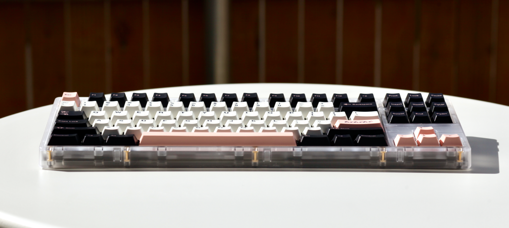
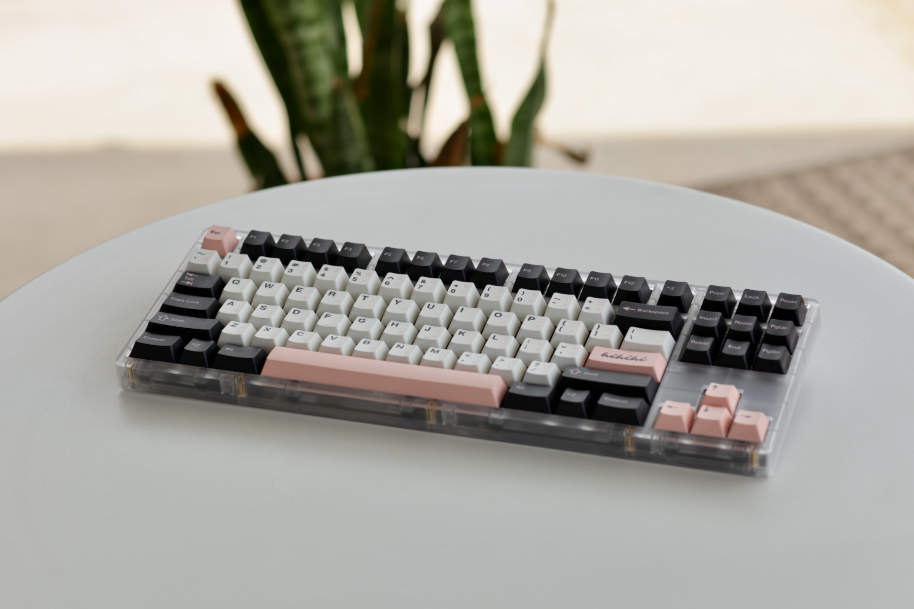
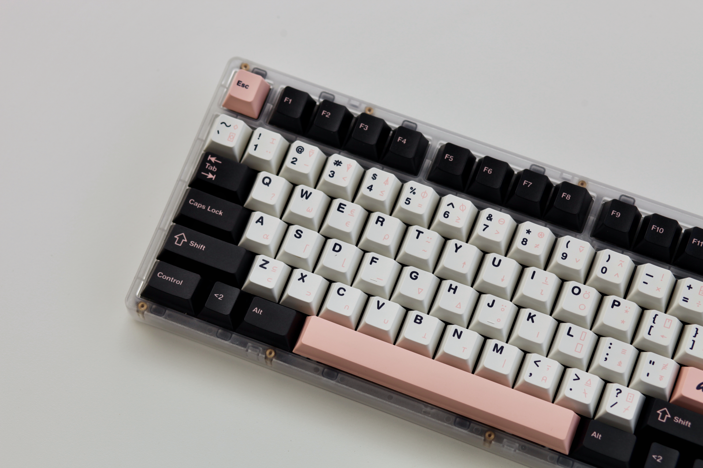
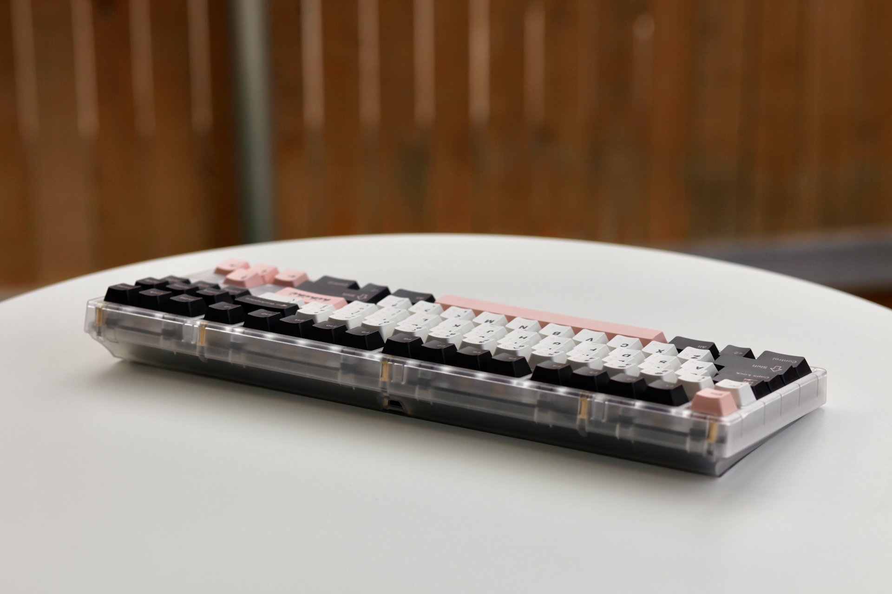

## Overview

[Tiger 80 Lite](https://divinikey.com/products/kbdfans-tiger-lite-tkl-keyboard-kit?variant=40209142612033) from [KBDFans](https://kbdfans.com/) and ordered from [Divinikey](https://divinikey.com/). The colorway is called Transparent White.

[Cherry Olivia APL](https://novelkeys.com/products/cherry-olivia?variant=43001363431591) keycaps from [NovelKeys](https://novelkeys.com/). These are made with PBT plastic and are cherry profile. This variant also has pink APL sublegends. I'm not sure what the backstory is with these sublegends but I do like how it adds to the overall look. these were the only variant for sale at the time. Really great affordable alternative to GMK Olivia keycaps.

Switches are Gateron Black Ink V2s lubed with krytox 205g0. Pretty happy with the switches but I may change these out to use something with heavier springs, which has been my preference lately.

## Thoughts

The **Tiger 80 Lite** is one of the most versatile keyboards I have in my collection. It's discontinued now, but it was a really affordable offering at the time. As the name suggests, it's made of plastic and it's really light. This is the lightest TKL that I have and it's not a backbreaking task to bring this to the office or a coffeshop for a more enjoyable laptop setup.

As for the colorway, it's a smoky clear plastic. I find this to be a really versatile colorway that won't distract too much from the keycap's colorway. I've had Olivia on here for a while, but off the top of my head, I'm thinking I'll change Olivia out for Bingsu or Peaches Lite.

## Photos

Decided to grab the old Canon 5D Mark II for these photos. I've got a little patio at home so as long as there's some daylight, It's not too difficult getting a some decent pics outside with a minimal setup. I just have a white table and my camera. That's it.

The 5D is my only camera with interchangable lenses. I shot these with the Canon EF 85mm 1.8. I find that keyboards look better when photographed with a telephoto lens. The compression is more flattering vs. a wide-angle lens. And, I didn't have to do much in post. But, with that said, I'm not really that good with photo editing lol, so I just shot these photos in JPEG and did some light editing in Apple Photos on my macbook.

I'm learning more about how to setup my cameras with better auto settings:

- **Shutter speed at 1/250 seconds**: I set my camera to shutter priority and kept shutter speed at 1/250 to avoid blurry photos since I'm shooting handheld.
- **Aperture set between f4 and f/8**: I used to focus stack in post, but I don't wanna do that anymore 😅 so, a larger depth of field is preferable to see more of the keyboard in focus.
- **ISO 100**: set this to lowest ISO setting to reduce noise and made 1 stop adjustments with exposure compensation.

