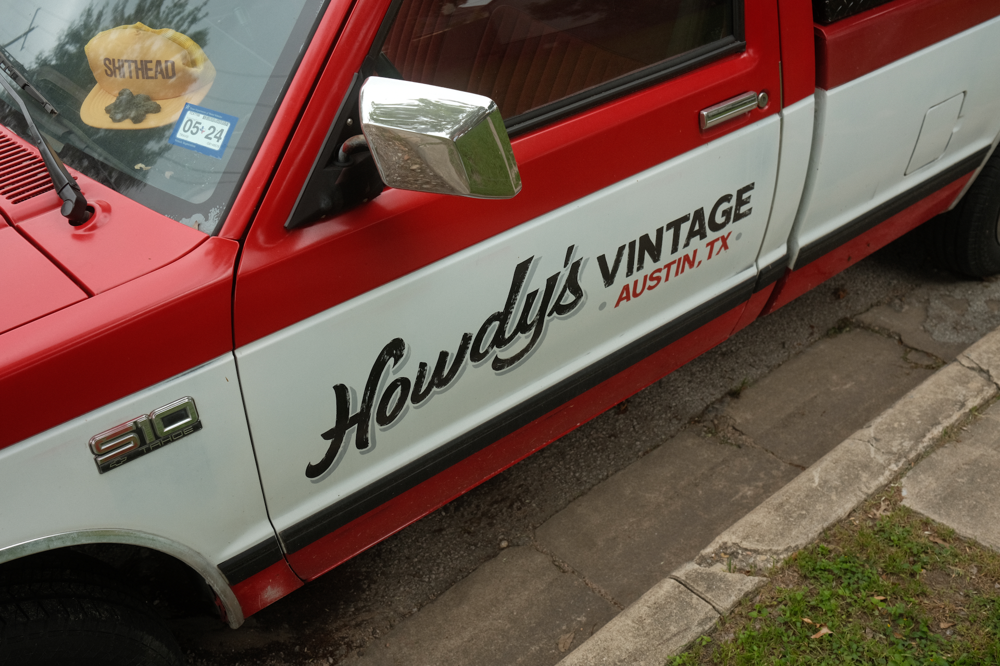

I'm trying a slightly different setup with my [Fuji X100V](https://brianhan.com/tags/fuji%20x100v/). Instead of relying on film simulation bracketing, I'm manually switching between film recipes in my custom profiles. I'm still using [Reggie's Portra](https://reggiebphotography.com/blog/the-most-versatile-fujifilm-x-trans-iv-film-simulation-recipe-reggies-portra), and I've also added [Reggie's HP5 B&W](https://reggiebphotography.com/blog/the-most-versatile-fujifilm-x-trans-iv-film-simulation-recipe-reggies-hp5) film recipe in the rotation. I think his black-and-white recipe looks noticeably better than using Acros stock.

For me, the tough part with wanting to use both of these film recipes is taking the time to switch between them. It's definitely not as convenient as using film sim bracketing.

## El Chilito on Manor

---

## Cool dudes, and their rides

I was surprised to get photos of dudes riding their bikes that weren't terrible! I was using single-point auto focus, and felt like my shots were getting off a little slow, but it worked out. I'll have to start learning how to properly range focus for moments like this.

Also, I'm pretty sure one of these guys is headed to the kite festival. Can you guess who?

---

## More from Manor

