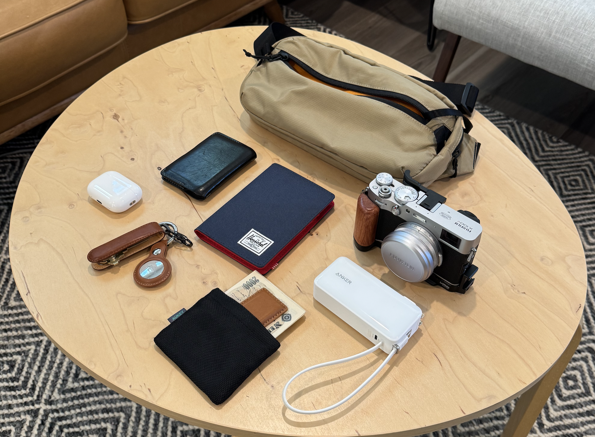

Going to Japan, again!

This is my 3rd time around - I can't remember exactly how I packed on my first trip but my last trip was in 2019, I went with a [Peak Design Travel Backpack](https://www.peakdesign.com/products/travel-backpack?Size=45L&Color=Sage). One bag travel - love the idea of it, may still do it for shorter domestic trips in the future. But for this trip, I'm going with a few bags.

## Multiple bags

Rolling carry-on luggage, an empty [Evergoods TD35 duffel](https://evergoods.us/products/transit-duffel-35l), [Tomtoc 3.5L sling](https://www.tomtoc.com/products/aviator-t33-chest-bag?variant=45092308156646), and [this Weekender dupe from Costco](https://www.costco.com/Swissgear-Weekender-Tote,-Black.product.1819480.html) - I think it's a dupe of this [Beis Weekender bag](https://beistravel.com/products/the-weekender-in-black), or maybe this is a common design 🤷‍♂️

Either way, this bag choice was a last-minute decision - I really liked the idea of the zippered bottom compartment specifically for my CPAP machine. All of the stuff I need for sleeping fits in that bottom compartment with some extra room for a set of clothes. The clothes help to fill out the bottom and gives some padding around the CPAP.

With the bottom packed out, the main upper compartment can carry my sling and a pouch that holds my camera gear.

The rolling-carry on luggage has one side packed with my empty duffel, and the other side is clothes: socks, underwear, tshirts, one extra pair of pants, and a belt.

## In transit

While I'm in transit, going through airports and train stations, I figured I can keep my camera gear packed away. Everything else that I want quick access to can fit in my sling, which I can optionally wear or throw it into my weekender bag, which can sit on top of my rolling luggage since it has a luggage pass-through.

## Sling in-transit

Everything packed out here is stuff that I want on me when I'm on the plane, and at the airport. I have soooooo many slings, and I really enjoy using all of them but I finally decided on going with the [Tomtoc Aviator-T33 Chest Bag 3.5L](https://www.tomtoc.com/products/aviator-t33-chest-bag?variant=45092308156646). The size is just right for everything I want to carry, and it's really comfortable.

The first set of things I packed in my sling are items I plan on using frequently on the plane:

- [Anker Nano 3-in-1 Portable iPhone Charger, 10,000mAh Power Bank](https://www.amazon.com/gp/product/B0CX4BK8CX/)
- iPod + wired earbuds + headphone usb-c dongle
- [Miyoo Mini v4 retro handheld](https://www.amazon.com/Handheld-Console-2-8-inch-Miyoo-Mini-Portable/dp/B0DF2QVN4F/)
- AirPods
- iPhone 15 Pro (not pictured)

And the rest is just stuff that I'll have on me - less frequently used but I want quick access to it:

- Passport
- money + coin pouch
- Bellroy card wallet
- House keys + air tag
- Extra Apple Watch wrist strap
- USB-C cables
- Small Topo Designs zippered pouch

### Camera / Misc pouch

The pouch is just a [desk pouch from Bellroy](https://www.amazon.com/gp/product/B08LHDFNGT/) that's meant for desk accessories. This pouch is only used to carry camera and misc stuff that I don't need in transit.

- Fuji X100V
- Portable SSD
- [Clever Supply camera strap](https://cleversupply.co/products/anchor-camera-strap-peak?variant=32809750298759)
- Peak Design wrist strap
- USB-C SD card reader,
- Camera cleaning pen
- And some misc. things: phone / watch charger, and allen wrenches for my camera grip.

## Japan EDC

My plan for when I'm in Japan, I'll repack my sling for everyday carry.

- Fuji X100V
- AirPods
- Passport
- money + coin pouch
- Bellroy card wallet
- House keys + air tag
- [Anker Nano 3-in-1 Portable iPhone Charger, 10,000mAh Power Bank](https://www.amazon.com/gp/product/B0CX4BK8CX/)

And with all of that packed, I'll still have some room for my Portable WiFi and maybe one or both of my camera straps.

Everything else that isn't listed is stuff that I feel like can stay at the hotel since I don't expect to need them while I'm out and about.
