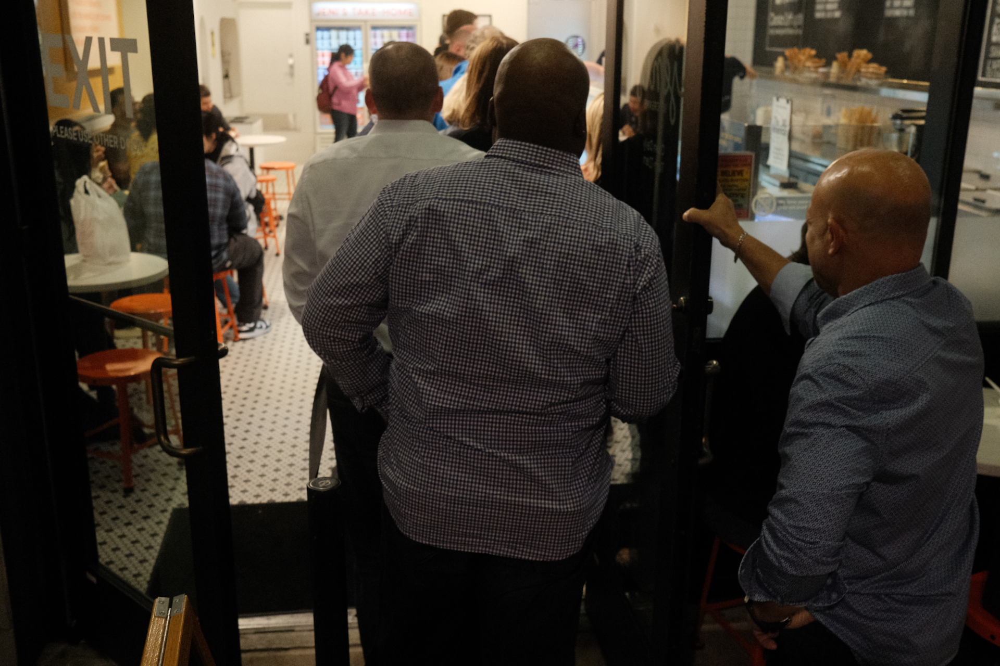
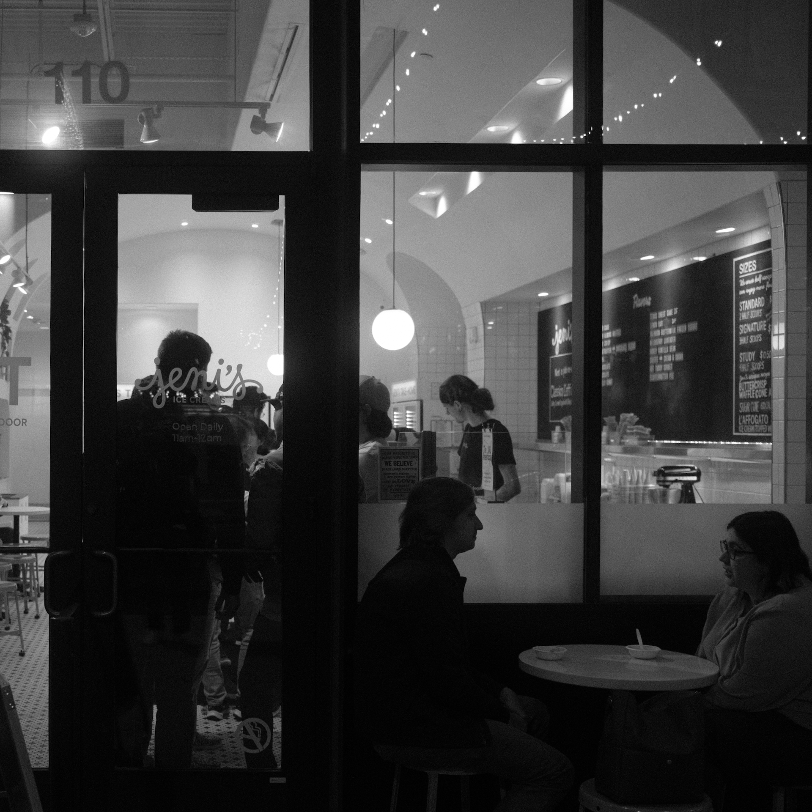
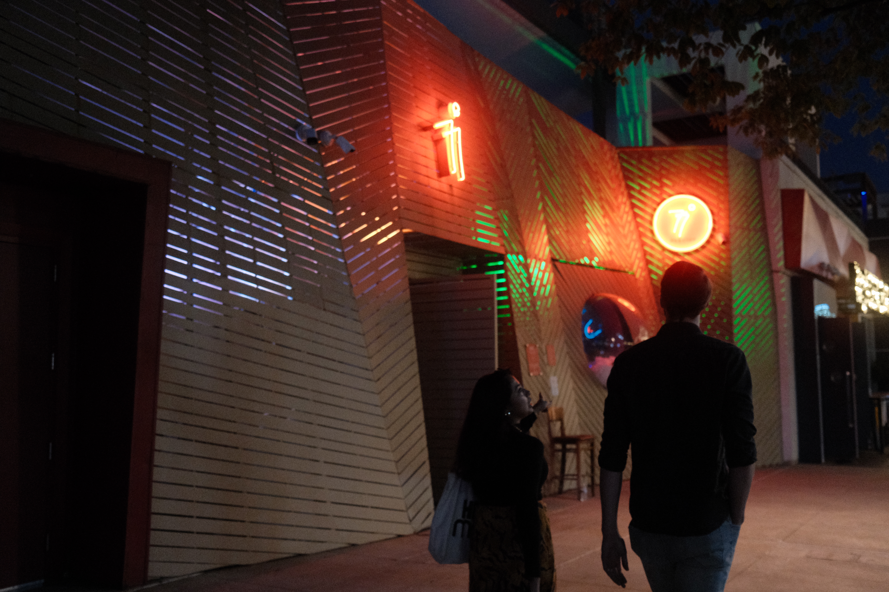
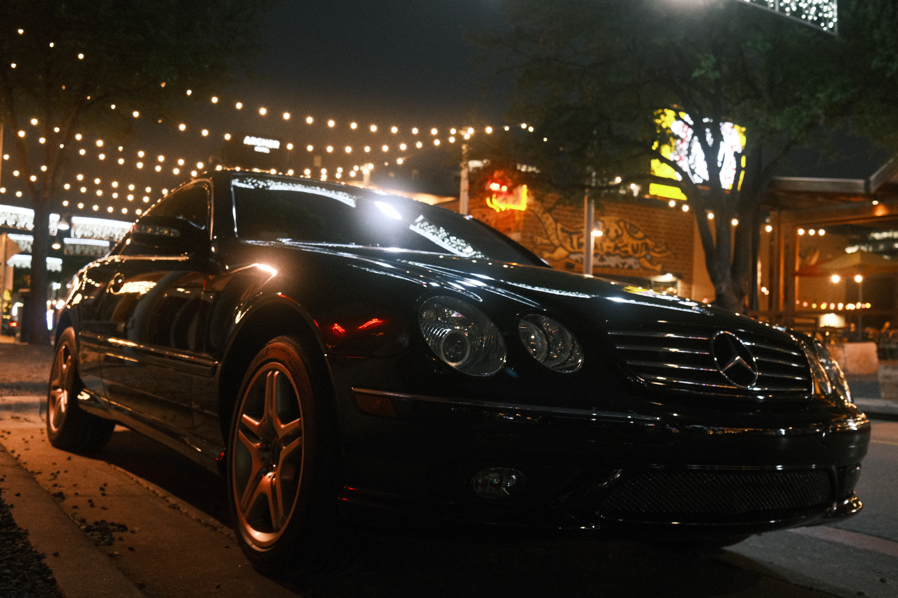
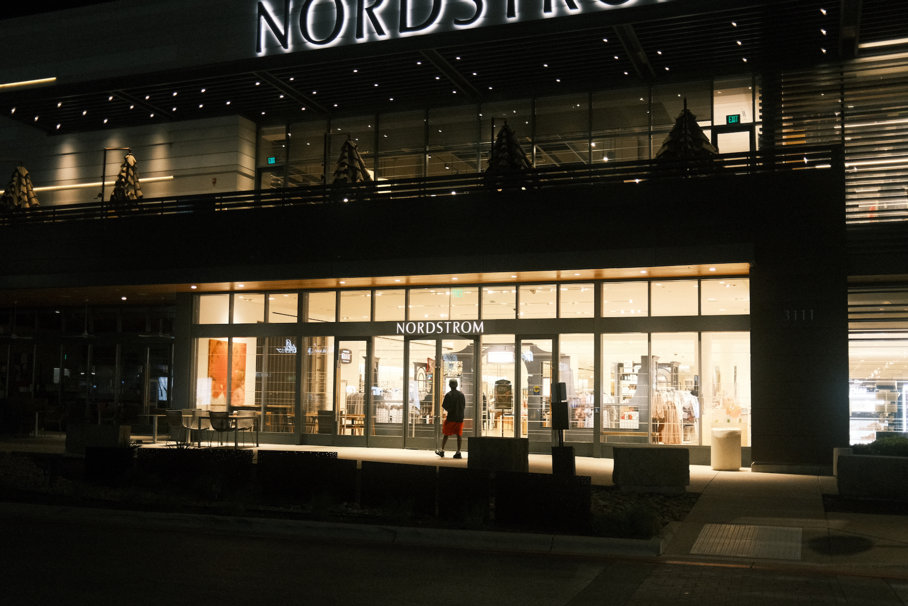
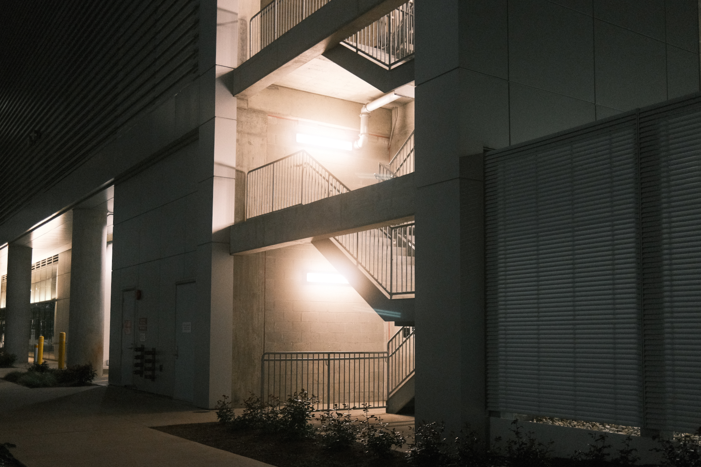
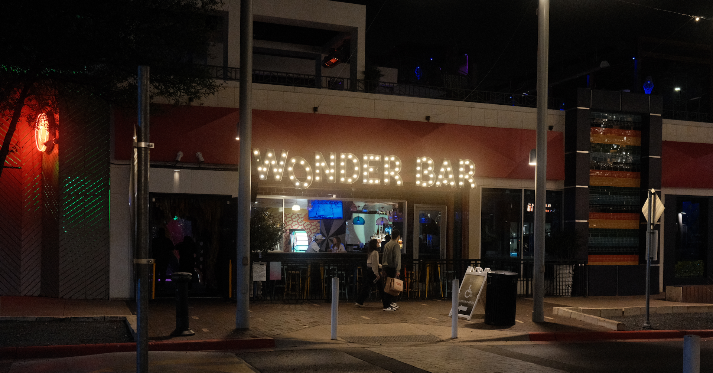
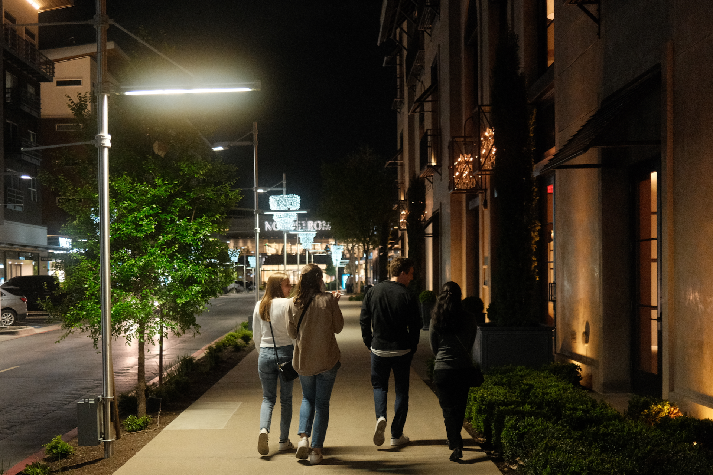

I recently got a used Fuji X100V, and brought it out tonight for some night photography.
It's equipped with a [Cinebloom Filter from Moment (10% diffusion)](https://www.shopmoment.com/products/moment-cinebloom-diffusion-filters/49mm-10-strength?irgwc=1&partner_id=2598579&timestamp=1708496573319). I was excited to see the cinebloom filter in action, and I found myself shooting a lot of neon signs and lights.

Put my camera in aperture priority mode, and film simulation bracketing mode. This let's me apply three different film simulations to a single photo. I can take one photo and get three JPEGs, each with its own film simulation. I used [Reggie's Portra](https://reggiebphotography.com/blog/the-most-versatile-fujifilm-x-trans-iv-film-simulation-recipe-reggies-portra), Classic Negative, and Acros. The same camera settings for Reggie's Portra are also applied to Classic Negative and Acros. I only shot JPEGs, and opted not to shoot RAW since in the bracketing mode, the camera will capture 3 RAW photos for every shot taken.

All photos are _mostly_ straight out of camera - I cropped in on a few photos, and that's it!

