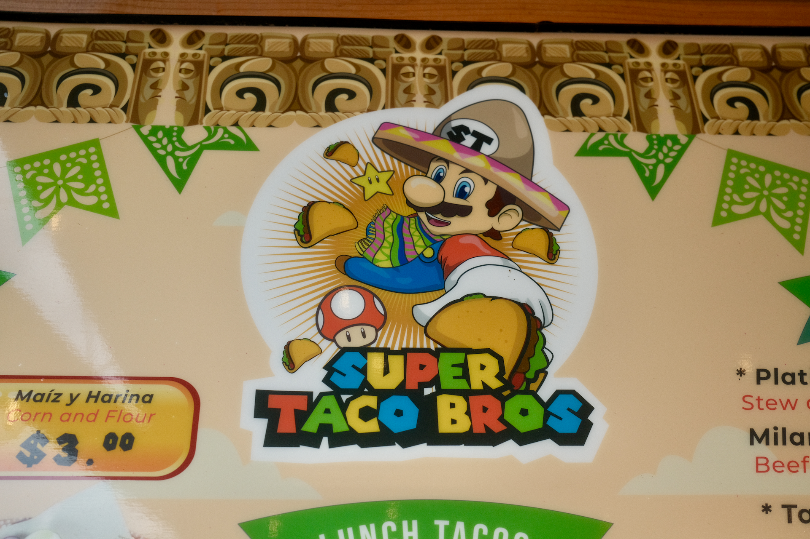
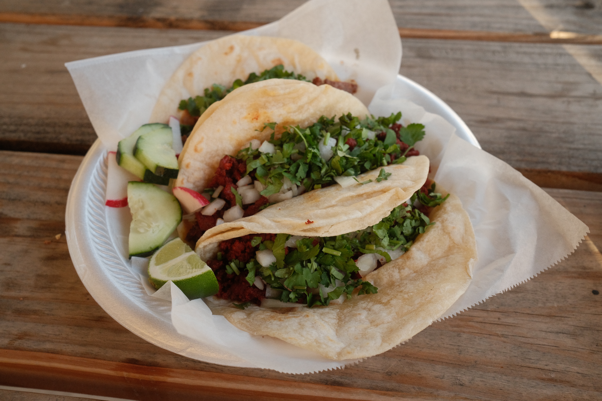
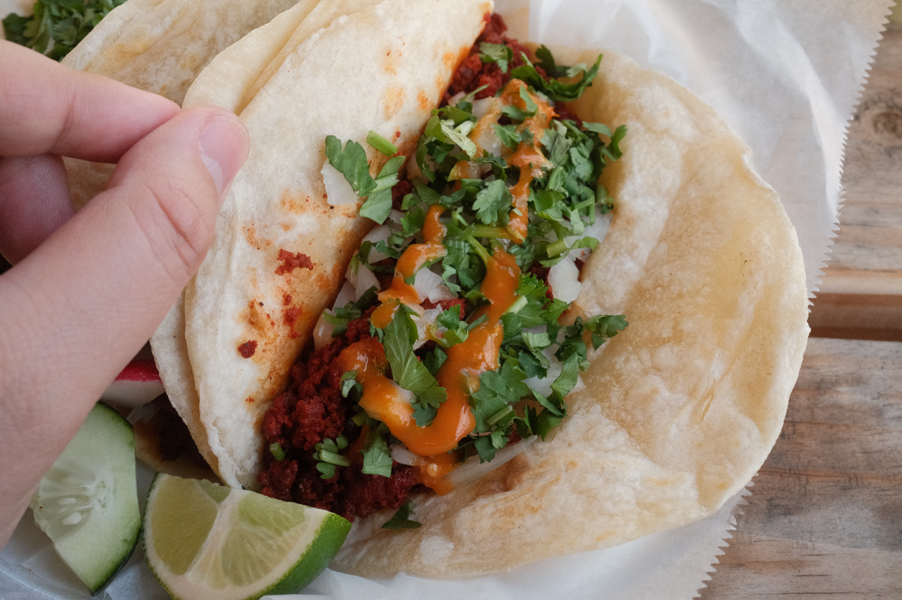
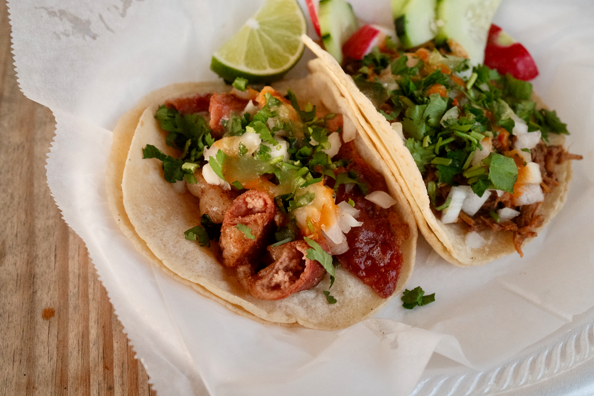
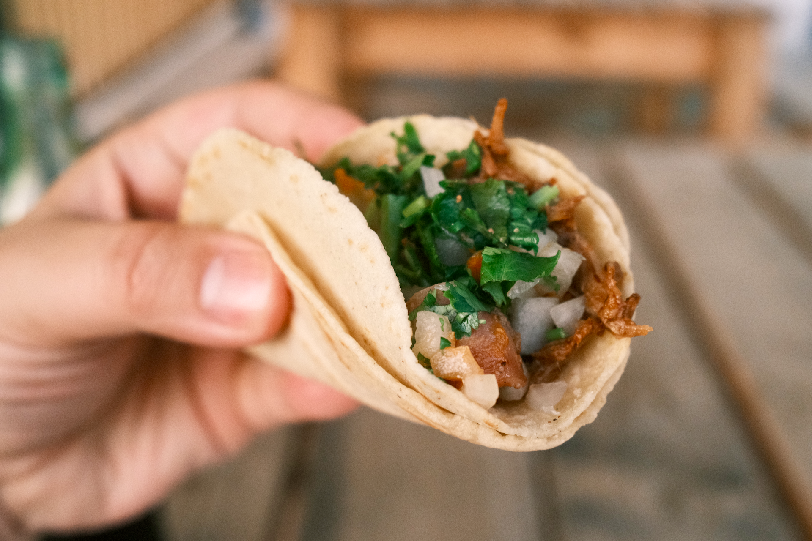

[Super Taco Bros](https://maps.app.goo.gl/AmNnUEAjAHNRYkVs6) is a relatively new food truck that's been open for almost a year. I'm only finding out about them now, and figured I would check them out.

Driving up, you may or may not notice there's a sprinkle of Mario inspired branding here - just enough to be recognizable, but hopefully not enough to get on Nintendo's radar.

---

The space here feels brand new. I was the only customer eating here when I visited. There's good amount of parking on site, and all of Ransom street to use for street parking.

I got a bunch of tacos: they're priced well, ranging from $3 to $4 each, and they're generously sized. I was pretty full after 3 tacos...and then I got 2 more for fun. I got: birria, campechano, chorizo, pastor, and tripas.

Since it's so close to home, I'm definitely going back for more.

---

---

> Photos taken with Fuji X100V using classic negative and reggie's portra film simulations. Camera set to aperture priority going between f/4 and f/8. JPEGs lightly edited in Apple Photos.
