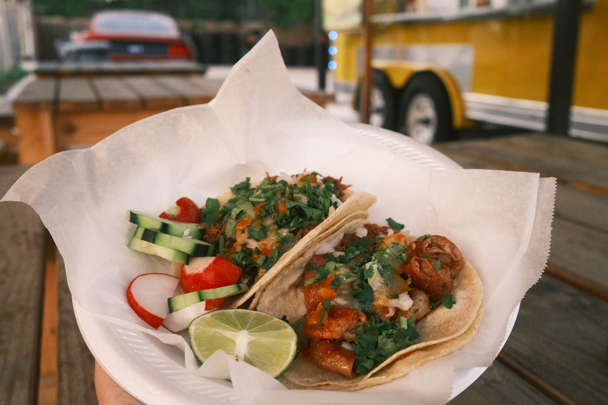

[Super Taco Bros](https://maps.app.goo.gl/AmNnUEAjAHNRYkVs6) is a relatively new food truck that's been open for almost a year now. I'm only finding out about them now, and figured I would check it out.

Driving up, you may or may not notice there's a sprinkle of Mario inspired branding here - just enough to be recognizable, but hopefully not enough to get on Nintendo's radar.

The space here feels brand new. Everything is really clean. I'm curious to see how this space feels when it's busier. I was the only customer eating here when I visited. There's good amount of parking on site, and all of Ransom street to use for street parking.

I got a bunch of tacos: they're priced well, ranging from $3 to $4 each, and they're generously sized. I was pretty full after 3 tacos...and then I got 2 more for fun.

Here's what I got:

- Birria
- Campechano
- Chorizo
- Pastor
- Tripas

Since it's so close to home, I'm definitely going back for more.
